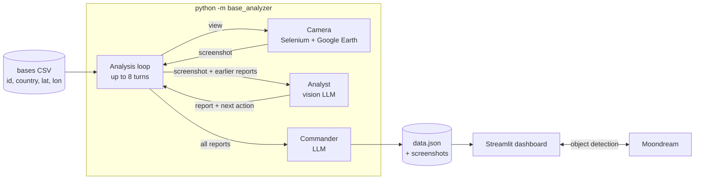

# Base Analyzer

**A team of AI imagery analysts that investigates suspected military sites from satellite imagery, the way a human analyst team would, and a dashboard to explore what they found.**

Give it a list of coordinates. For each one, a Selenium-driven browser opens Google Earth, and a series of vision-LLM analysts take turns examining the site. Each analyst reads what the previous ones wrote, then decides where to look next: zoom in, zoom out, pan left or right, or stop. A "commander" model then reconciles all the reports into a single assessment, with every claim tagged High, Medium or Low confidence.

## What it does

- **Autonomous investigation.** The model controls the camera. It is not given a fixed set of images. Each analyst chooses the next view based on what is unclear, so the investigation adapts to each site.
- **Multi-agent review.** Up to 8 analysts per site, each with the earlier reports as context. They are told to treat those reports as leads, not facts, so one analyst's guess does not become the next one's certainty.
- **Calibrated conclusions.** The commander separates what several analysts agree on from speculation, labels each observation with a confidence level, and lists what to check next in the imagery.
- **Interactive dashboard.** A Streamlit app shows a map of all sites grouped by country. Each site has a page with the commander's summary and one tab per analyst. You can type any object ("radar", "aircraft", "tank") and [Moondream](https://moondream.ai) locates it in the satellite image.

## How it works



Each turn of the loop:

1. The camera loads Google Earth at the current view (latitude, longitude, distance) and returns a JPEG screenshot.
2. The analyst gets the screenshot and the earlier reports and replies with structured JSON: **findings**, **analysis**, **things to continue analyzing**, and an **action**.
3. The loop applies the action to the view (zoom in/out changes the distance, move left/right shifts the longitude) and continues, until an analyst says `finish` or the turn limit is reached.

Then the commander gets every report and returns a summary, confidence-tagged observations and recommendations. The result is saved to `data.json` after each base, so a run can be stopped and resumed, and bases that are already analyzed are skipped.

## Engineering notes

- **Interfaces at the seams.** The analysis loop depends only on small `Camera` and `Analyst` protocols. The real adapters (Selenium, OpenAI) plug in at the edges, which keeps the core logic easy to read and test.
- **Tests with no network.** The test suite replaces Chrome and OpenAI with fakes, so it runs offline without API keys.
- **Defensive handling of model output.** Replies are parsed tolerantly (code fences and surrounding text are ignored), an unknown action falls back to `finish`, and a malformed reply skips that base instead of stopping the run.
- **Handles blocking.** If Google Earth fails to load twice in a row, the collector stops cleanly, because Google has probably blocked it for now.
- **Shared typed data model.** The collector and the dashboard read and write the same `Base` records through one store module.

## Tech stack

Python · OpenAI API (`gpt-5-nano` analysts, `gpt-5.4-nano` commander) · Selenium + Chrome · Streamlit · Moondream · Pillow · pytest

## Run it

```bash
python3 -m venv .venv && source .venv/bin/activate
pip install -r requirements.txt
cp .env.example .env        # add OPENAI_API_KEY and MOONDREAM_API_KEY
```

**Explore the results.** `data.json` already holds 15 analyzed bases:

```bash
streamlit run streamlit_app.py
```

**Analyze new bases.** This needs Google Chrome and an OpenAI key. Put the sites in `military_bases.csv`:

```csv
id,country,latitude,longitude
147,Egypt,23.95420291888193,32.99497151535935
```

```bash
python -m base_analyzer --csv military_bases.csv --limit 5
```

**Run the tests:** `pytest`

Screenshots are Google Earth imagery, so they are not committed. The collector takes them again. Without them, the dashboard still shows the reports and an **Open in Google Earth** link.

## Project layout

```
base_analyzer/
  __main__.py          collector entry point
  analysis_loop.py     the turn-taking loop; Camera and Analyst interfaces
  camera.py            Google Earth screenshots (Selenium)
  analyst.py           OpenAI analyst and commander, prompts, JSON parsing
  base_store.py        data.json and screenshots, typed Base records
  object_detection.py  Moondream object detection
streamlit_app.py       dashboard
tests/
```

> Every analysis is generated by an LLM from public satellite imagery and may be wrong. This is a learning project, not an intelligence product.
